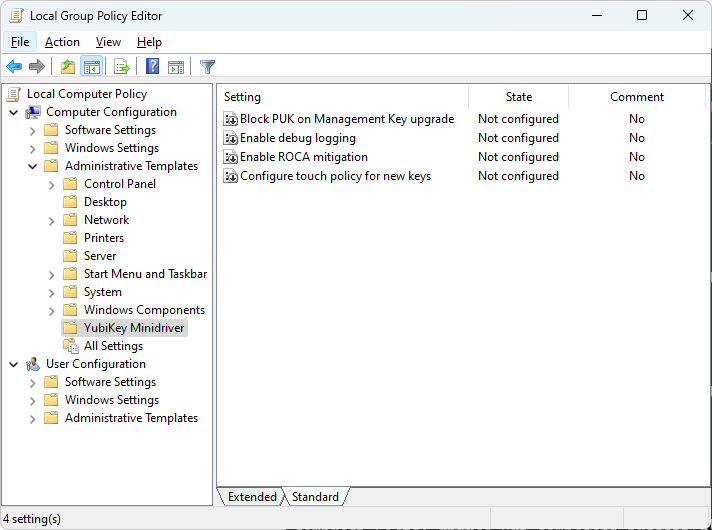
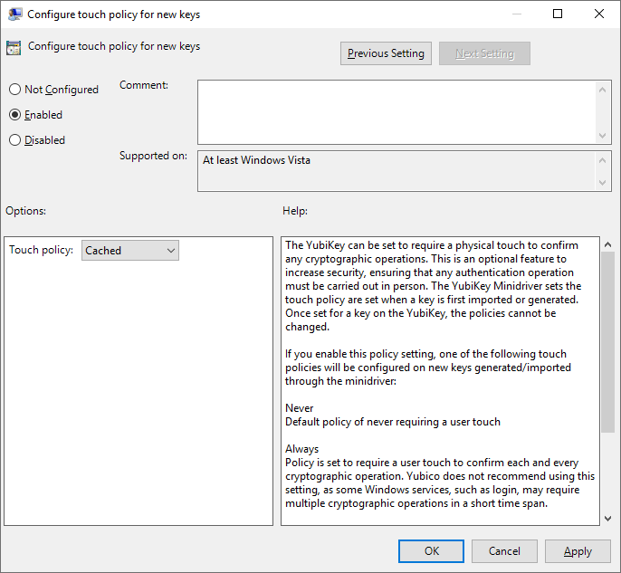

# Administrative Template (ADMX) for YubiKey Smart Card Minidriver

## Introduction

This ADMX administrative template allows administrators to easily deploy configuration of the [YubiKey Smart Card Minidriver](https://www.yubico.com/products/services-software/download/smart-card-drivers-tools/) through Active Directory Group Policy or Microsoft Intune. It can also be used on standalone computers to unlock some features of the YubiKey Minidriver that are disabled by default, like controlling the touch policy or blocking the generation of unsafe keys (ROCA).

## Screenshots

## Available Settings

These are the YubiKey Minidriver settings that can currently be configured, with their default values highlighted:

- Configure touch policy for new keys
  - **Never**
  - Always
  - Cached
- Enable ROCA mitigation
- Enable debug logging
  - Debug log verbosity
    - **Level 0 - Modify operations**
    - Level 1
    - Level 2
    - Level 3 - Very verbose
- Block PUK on Management Key upgrade
- Disable automatic BaseCSP cache management
- Enable card management key
- Configure device key refresh
  - **300 seconds**
- Disable support for the Always Prompt PIN
- Disable automatic fingerprint prompt
- Configure User PIN cache policy
  - **Normal**
  - Timed
  - None
  - Always prompt
- Configure External PIN cache policy
  - Normal
  - Timed
  - **None**
  - Always prompt
- Configure PIN cache timeout
  - **60 seconds**

The settings are on par with the 4.6.3.252 version of the Minidriver, released on May 21, 2024. Note that some settings are only applicable to devices that support slot metadata (YubiKey 5.2.7+).

## Installation

Just copy the [ADMX](PolicyDefinitions/YubiKeyMinidriver.admx) and [ADML](PolicyDefinitions/en-US/YubiKeyMinidriver.adml) files into the [local or central ADMX store](https://msdn.microsoft.com/en-us/library/bb530196.aspx#manageadmxfiles_topic2).

## Localization

Thanks to the awesome open-source community, the template has been translated into the following languages:

- **English**
- French
- Italian

If you want to contribute with a new localization, you can create a language-specific copy of the [en-US ADML file](PolicyDefinitions/en-US/YubiKeyMinidriver.adml).

## References

The ADMX template is based on the following official document:
- [Deploying the YubiKey Minidriver to Workstations and Servers](https://support.yubico.com/hc/en-us/articles/360015654560-Deploying-the-YubiKey-Minidriver-to-Workstations-and-Servers#Installing-via-Group-Policy-Object)
