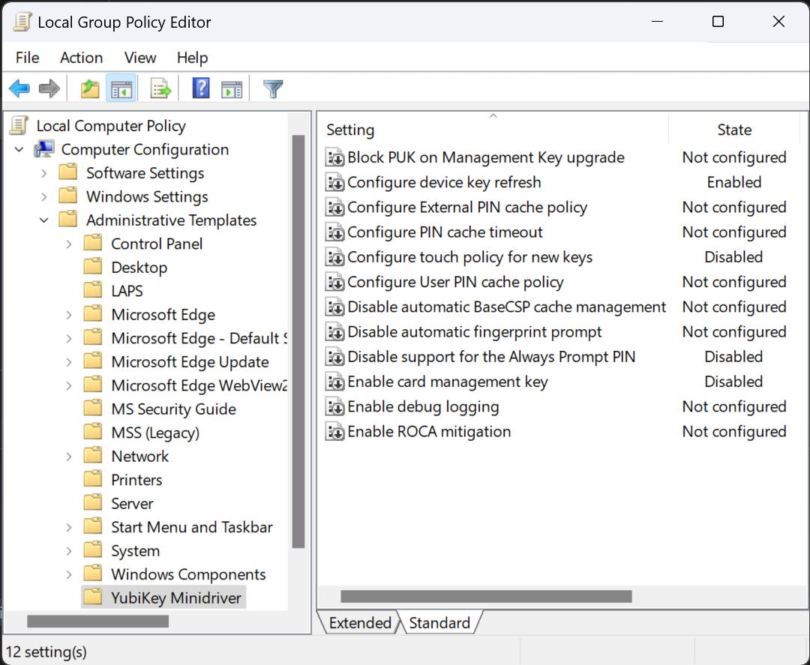

# Administrative Template (ADMX) for YubiKey Smart Card Minidriver

## Introduction

This ADMX administrative template allows administrators to easily deploy configuration of the [YubiKey Smart Card Minidriver](https://www.yubico.com/products/services-software/download/smart-card-drivers-tools/) through Active Directory Group Policy. It can also be used on standalone computers to unlock some features of the YubiKey Minidriver that are disabled by default, like controlling the touch policy or blocking the generation of unsafe keys (ROCA).

## Screenshots

## Available Settings

These are the YubiKey Minidriver settings that can currently be configured, with their default values highlighted:

* Configure touch policy for new keys
  - **Never**
  - Always
  - Cached
* Enable ROCA mitigation
  - Enabled
  - **Disabled**
* Enable debug logging
  - Enabled
  - **Disabled**
* Block PUK on Management Key upgrade
  - **Enabled**
  - Disabled

## Installation

Just copy the ADMX and ADML files into the [local or central ADMX store](https://msdn.microsoft.com/en-us/library/bb530196.aspx#manageadmxfiles_topic2).

## References

The ADMX template is based on the following official document:
- [Deploying the YubiKey Minidriver to Workstations and Servers](https://support.yubico.com/hc/en-us/articles/360015654560-Deploying-the-YubiKey-Minidriver-to-Workstations-and-Servers#Installing-via-Group-Policy-Object)
